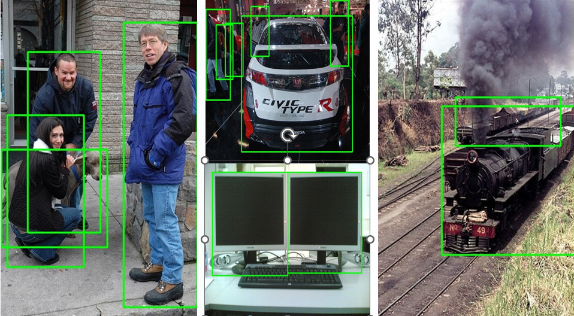
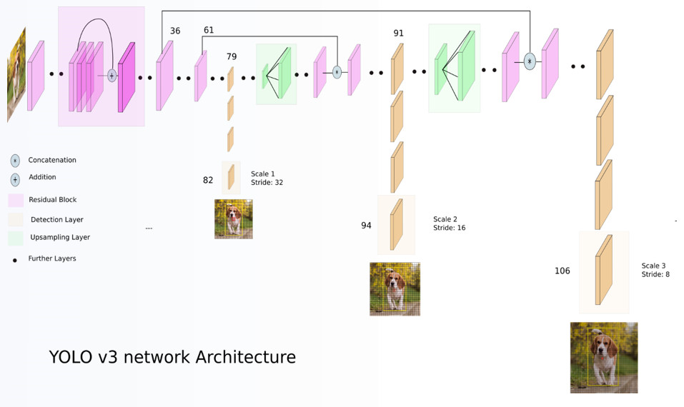
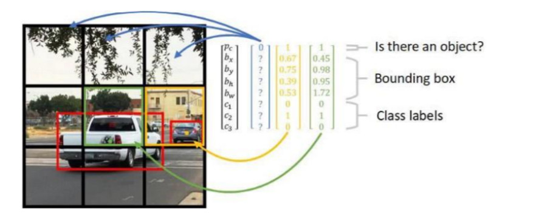
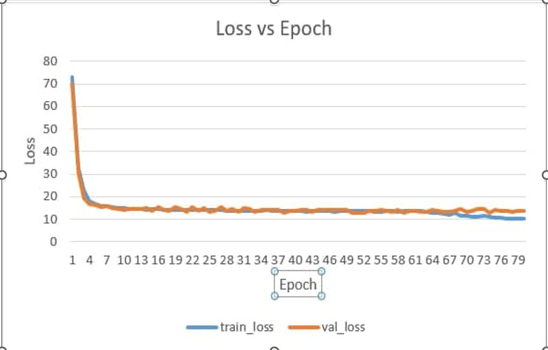
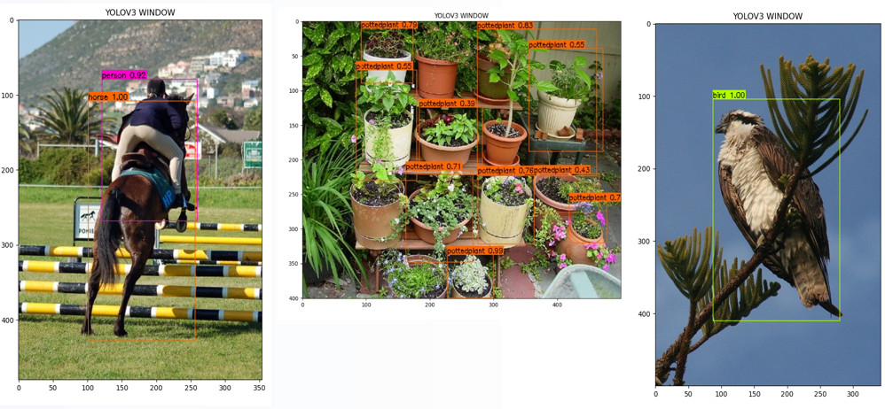

# Real-Time-Object-Detection-for-Blind-People
Model Used: YOLO V3, Faster RCNN

## **Dataset Description**
-   Pascal VOC 2007 dataset is used to train the model.
-   In Pascal VOC dataset there are total 9963 images and 24640 annotated objects in train and test dataset. In train dataset there are 5011 images and 15662 annotated files. Also there are 4952 images in test dataset.
-   All the images of dataset are RGB images. There are 20 classes to detect in the dataset.

 

Here are some image with annotations from dataset
 
 

   

   

## **YOLO V3 Architecture**

 

   

   

## **Working Method**
-   The model splits the input image into a grid.
-   The model is applied to an image at different scales and locations.
-   Prediction occurs in 3 scales such as 13×13, 26×26 𝑎𝑛𝑑 52×52.

 

   

   

## **Loss Function & Metrics**
-   Square Loss
-   Logistic Regression Loss

Intersection Over Union (IoU) metric is used which reflects how good the predicted bounding box is for a particular object.

 

   

   

## **Predicted Results**
 

   

  

So the trained model perfectly predicts the objects.

  

## **Faster RCNN**
All the files related to Faster RCNN model are resides in this <a href= "https://github.com/nihan139/Real-Time-Object-Detection-for-Blind-People/tree/main/Faster%20RCNN">folder</a>. All the weights and dataset for the model training and testing can be found in this drive <a href= "https://drive.google.com/drive/folders/1jgNF4LBug-9OM2_dienTwhdmLnsOgFEe?usp=drive_link">link</a>.

`Faster R-CNN` is an updated version of RCNN family which follows a new architecture called region proposal network(RPN). So basically faster rcnn is a combination of RPN and Fast R-CNN . In short, `region proposal network (RPN)` is a fully convolutional network that generates proposals with various scales and aspect ratios. The RPN implements the terminology of neural network with attention to tell the object detection (Fast R-CNN) where to look.
Details of the architecture of Faster R-CNN can be found on this <a href= "https://arxiv.org/abs/1506.01497"> Paper</a>.

## Experiment with Faster R-CNN:

For our task we have to convert the given data in proper format before using them in training. For pre-processing look onto this <a href= "https://github.com/nihan139/Real-Time-Object-Detection-for-Blind-People/blob/main/Faster%20RCNN/Object_Detection_DataPreprocessing.ipynb">notebook</a>.  For training purpose we have implemented Faster RCNN from scratch and fed the data for training. Training notebook can be found <a href= "https://github.com/nihan139/Real-Time-Object-Detection-for-Blind-People/blob/main/Faster%20RCNN/frcnn_train_vgg.ipynb"> there</a> and for inference use this <a href= "https://github.com/nihan139/Real-Time-Object-Detection-for-Blind-People/blob/main/Faster%20RCNN/frcnn_test_vgg.ipynb">notebook</a>.

As Faster RCNN is a two setp detection model we have to optimize loss for both steps. We used `binary cross entropy loss` function for classification and `smooth L1 loss` for our bounding box regression task. We use a optimization function which is a optimizes both of these two loss function. The loss profile of our trianing is given bellow.  

   

## Results of our experiment with Faster RCNN:

   
   

## **Contributors**
1. Md. Tasnim Azad
2. Sabbir Hossain Ujjal
3. Md. Tajbid Zaman Rhythm
4. Kazi Moheuddin Alamgir
5. Md. Tanveer Aziz Durbar
